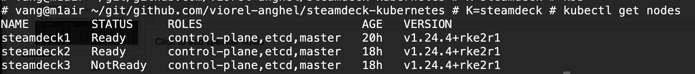

# steamdeck kubernetes

Read the official RKE2 Kubernetes installef docs at https://docs.rke2.io/

1. 
- on steamdeck open terminal: click STEAM button, scroll down to Power, choose *Switch to desktop*
then menu - konsole
- in terminal (konsole) use the command 'passwd' to setup a password for user deck
- note STEAM+X shortcut to open the virtual keyboard

2. become root using `sudo su`. ignore the error 'tune2fs bad magick number'. you are root

3. run `systemctl start sshd` to start the ssh server. also `systemctl enable sshd` to enable it on boot

4. check your ip address with `ip a`

5. 
- use a computer to `ssh deck@<IP address>` with password. 
- run `sudo su -` to become root. the - at the end of this command in important.
- verify with `pwd` you are under the /root directory

6. preparations for the rke2 part. download the rke2 installer and save it as a file:
```
curl -sfL https://get.rke2.io >rke2.sh
```

7. before running the installer, /var is very limited on space. create a symbolic link like this:
```
mkdir /opt/var_lib_rancher
ln -s /opt/var_lib_rancher /var/lib/rancher
```

8. before running the installer, change the hostname if you plan to create a cluster
```
nano /etc/hostname # set steamdeck1 or 2/3 etc
# also run
hostnamectl set-hostname steamdeck1   # or 2/3 etc
``` 

9. setup your path. run
```
export PATH=$PATH:/opt/rke2/bin:/opt/var_lib_rancher/rke2/bin/
# also add that line to the very end of .bashrc file 
nano .bashrc 
```

10. run the installer. ignore the "/usr/local is read-only" warning
```
bash rke2.sh 
touch: cannot touch '/usr/local/.rke2-ro-test': Read-only file system
[WARN]  /usr/local is read-only or a mount point; installing to /opt/rke2
[INFO]  finding release for channel stable
[INFO]  using v1.24.4+rke2r1 as release
[INFO]  downloading checksums at https://github.com/rancher/rke2/releases/download/v1.24.4+rke2r1/sha256sum-amd64.txt
[INFO]  downloading tarball at https://github.com/rancher/rke2/releases/download/v1.24.4+rke2r1/rke2.linux-amd64.tar.gz
[INFO]  verifying tarball
[INFO]  unpacking tarball file to /opt/rke2
[INFO]  updating tarball contents to reflect install path
[INFO]  moving systemd units to /etc/systemd/system
[INFO]  install complete; you may want to run:  export PATH=$PATH:/opt/rke2/bin
```

11.
- start it with `systemctl start rke2-server`. 
- this will take some time on the first run since it downloads stuff.
- check with `systemctl status rke2-server`

12. for kubectl easy access
```
mkdir -p .kube
ln -s /etc/rancher/rke2/rke2.yaml .kube/config
```
13. finally, run
```
kubectl get nodes
NAME         STATUS   ROLES                       AGE    VERSION
steamdeck1   Ready    control-plane,etcd,master   6m4s   v1.24.4+rke2r1
```

14. if you wish this to start on boot, run `systemctl enable rke2-server`

15. if you setup a single node that's all. you can run kubectl commands now.

---

## For the second and third node

Steps up until step 10 are the same. 
You need to create a config file before the step 10:

```
mkdir -p /etc/rancher/rke2/   # create this directory
nano /etc/rancher/rke2/config.yaml # create a file in there
```
with this content
```
# file /etc/rancher/rke2/config.yaml
server: https://<FIRST-NODE-IP>:9345
token: <get this from FIRST NODE file /var/lib/rancher/rke2/server/node-token>
```

After you have this config file,  steps 10 + 11 are the same. When this is done, ssh into the first node
and verify `kubectl get nodes`. Wait until the nodes are in *Ready* state.

Steps 12, 13 are optional on second/thirs node. Do step 14 though.



---

## Full cleanup

If you wish to restore the system in the original state, rke2 can be uninstalled with the script `rke2-uninstall.sh` (as root, obviously). If you wish, also stop and disable sshd.

